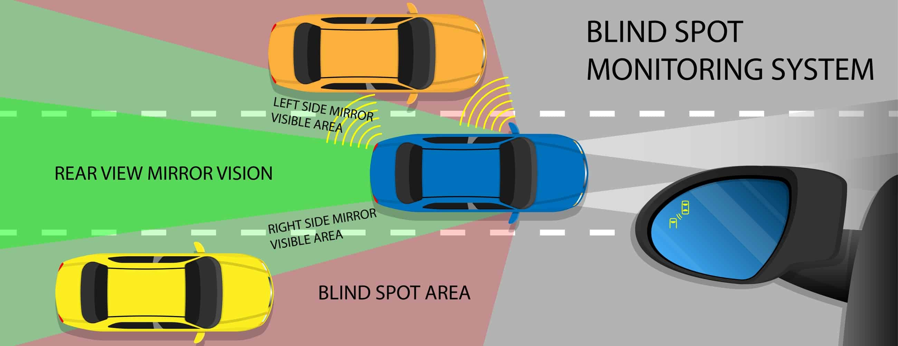
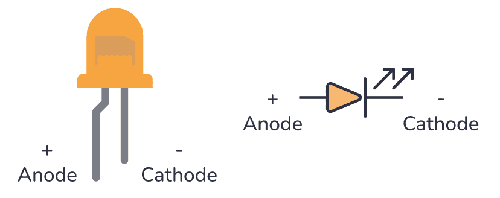
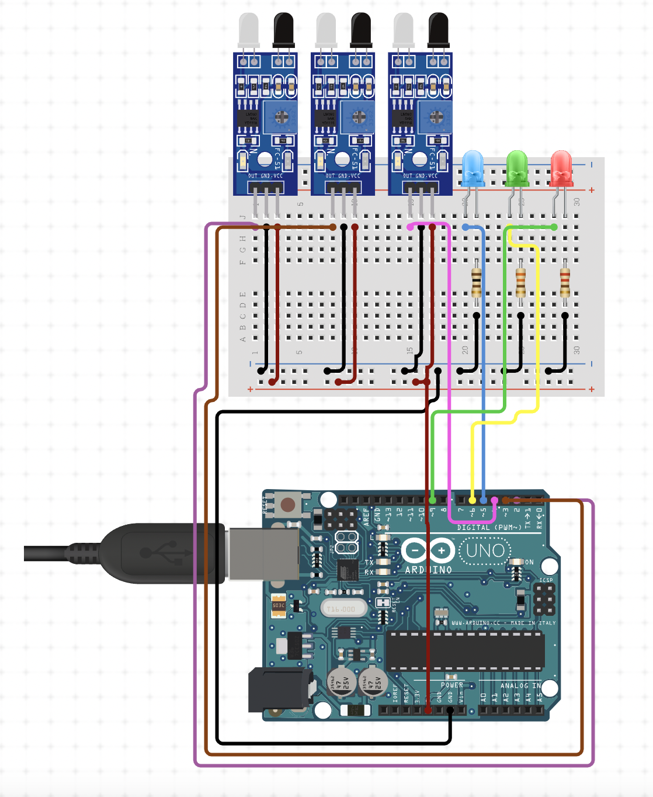

# Intro to Hardware Workshop

## Goal

Use 3 LEDs to represent when there is an object in front of the left and right mirrors of a car. Additionally, use the third LED to represent when there is an object at the rear. Optionally, you can implement a photoresistor to trigger an LED to demonstrate automatic headlights.

---

## Prerequisites
- Installed **Arduino IDE**
- Basic understanding of **Programming in C/C++**
- Basic understanding of **Schematic Interpreation**

---

## Concepts Covered
1. **Breadboarding**:
   - Focus on **Series Configurations** for circuit assembly.
2. **Understanding Resistors**:
   - Learn how to read and choose the correct resistor for your LEDs.
3. **Understanding Diodes**:
   - Learn the basics of diodes and their behavior in circuits.
4. **Understanding Pinout Diagrams**:
   - Navigate Arduino and sensor pinout diagrams effectively.
5. **Infrared Sensor Basics**:
   - Learn how IR sensors detect objects, generate signals, and how to adjust sensitvity.
6. **Analog vs Digital Signals**:
   - Understanding the difference between digital and analog sensor outputs.
7. **Photoresistor Integration** (Optional):
   - Learn how photoresistors can be used to detect ambient light levels.
8. **LED Brightness Control** (Optional):
   - Using **Pulse Width Modulation (PWM)** to dim LEDs programmatically.
  

  

This diagram explains what a LED (light emitting diode) is and how to interpret the physical component. 

---

## Materials

- **Arduino Uno R3** (1)
- **Infrared Sensors** (3)
- **Photoresistor** (Optional, 1)
- **LEDs** (3-4)
- **Resistors** (3-4, 220-330 Ω recommended)
- **Jumper Wires** 
- **Breadboard**
- **Screwdriver** (Optional)
- **Multimeter** (Optional)

---

## Schematic

---

## How to Reproduce
1. **Wire the Circuit**:
   - Follow the schematic provided (ensure proper connections for sensors, LEDs, and resistors).
2. **Build Incrementally**:
   - Test individual components for functionality before integrating them.
3. **Choose the Correct Board and Port**:
   - Ensure the correct **board** (Arduino Uno) and **COM port** are selected in the Arduino IDE.
4. **Upload the Code**:
   - Write and upload the Arduino sketch for functionality.

  

If all goes well, then it should look a little something like this!

---

## Reference Resources
- [Arduino Uno Rev3 Documentation](https://docs.arduino.cc/hardware/uno-rev3/)
- [Arduino Tutorials Home Page](https://www.arduino.cc/en/Tutorial/HomePage)
- [Arduino IDE Getting Started Guide](https://docs.arduino.cc/learn/starting-guide/the-arduino-software-ide/)
- [Arduino Board Not Detected](https://support.arduino.cc/hc/en-us/articles/360016119519-Troubleshooting-for-boards-not-detected-by-PC)
- [IR Sensor Basics](https://components101.com/sensors/ir-sensor-module)
- [Photoresistor Basics](https://components101.com/resistors/ldr-datasheet)
- [LED Basics](https://learn.sparkfun.com/tutorials/light-emitting-diodes-leds/all)
- [Ohm’s Law Explanation](https://learn.sparkfun.com/tutorials/voltage-current-resistance-and-ohms-law)

